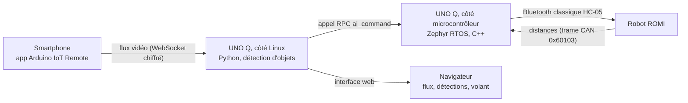
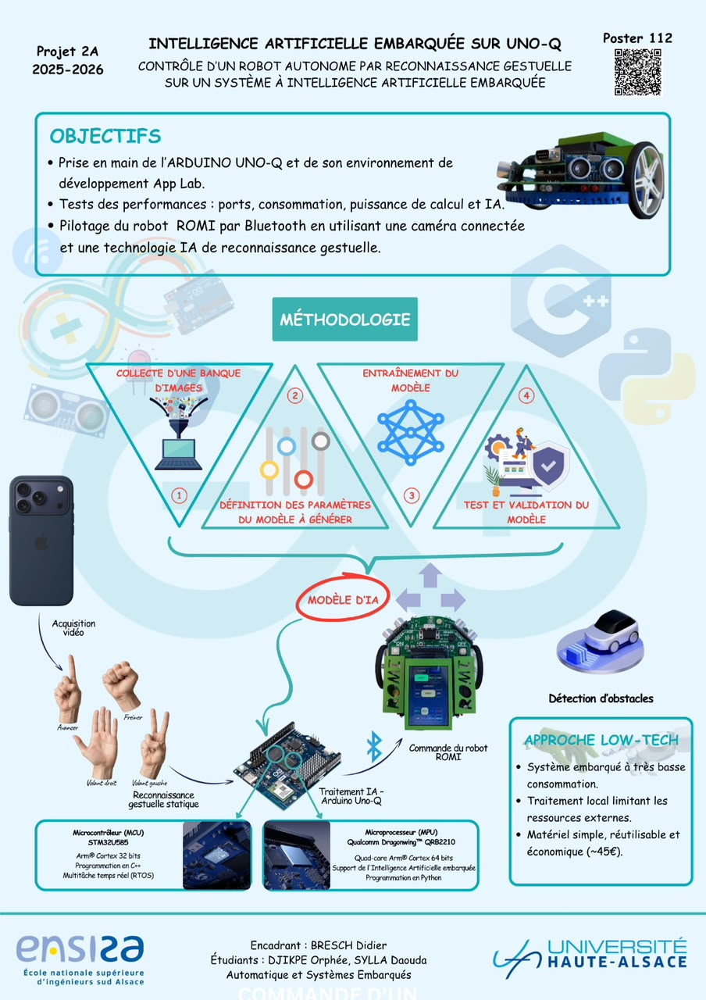

# Pilotage gestuel d'un robot ROMI avec l'Arduino UNO Q (Edge AI)

> Un robot mobile **ROMI** piloté par gestes : la caméra d'un smartphone envoie son flux à une carte **Arduino UNO Q** qui exécute un modèle de détection **en local** ; les gestes reconnus sont traduits en commandes envoyées au robot en **Bluetooth classique (HC-05)**, par un firmware **Zephyr RTOS** multitâche.

**Statut :** prototype fonctionnel · **Cadre :** Projet 2A 2025-2026, ENSISA (Université de Haute-Alsace), encadré par Didier BRESCH, réalisé en binôme avec Orphée DJIKPE · **Vidéo :** À COMPLÉTER (lien ou GIF)

<!-- Mets ici un GIF (< 10 Mo) ou un lien vidéo : c'est la première chose qu'un recruteur regarde. -->


## Ce que fait le projet

Reconnaissance de **gestes statiques de la main** (4 classes) :

| Étiquette du modèle | Geste | Commande | Effet sur le robot |
|---|---|---|---|
| `Avancer` | un doigt levé (index) | `AV` | le robot avance |
| `Freiner` | poing fermé | `FR` | le robot s'arrête |
| `Volant Droit` | main ouverte | `VD` | braquage +10 (max +100), clignotant droit au-delà de +19 |
| `Volant Gauche` | deux doigts levés | `VG` | braquage −10 (min −100), clignotant gauche au-delà de −19 |

Objectifs du projet (poster) : prise en main de l'Arduino UNO Q et d'App Lab, test de ses performances (ports, consommation, puissance de calcul, IA) et pilotage du ROMI par Bluetooth avec une caméra connectée et une IA de reconnaissance gestuelle. Approche « low-tech » : traitement local, matériel simple et réutilisable, carte à environ 45 €.

En parallèle, le firmware interroge les télémètres du robot (10 fois par seconde) et déclenche une **alerte sonore** si un obstacle est à moins de 20 (unité du capteur) pendant que le robot avance. Une interface web affiche le flux, les détections récentes, le seuil de confiance et la position du volant.

## Architecture



Détail des tâches temps réel et du protocole : [`docs/architecture.md`](docs/architecture.md) et [`docs/protocol.md`](docs/protocol.md).

## Poster du projet



## Ce qui est de moi, ce qui vient d'Arduino

Ce projet a été réalisé **en binôme** (avec Orphée DJIKPE). Ce dépôt part de l'exemple officiel **« Detect Hands on Smartphone Camera »** d'Arduino App Lab (licence MPL-2.0), dont il reprend l'interface web et le pipeline de détection. **Ma contribution** (tout sauf l'entraînement du modèle) :

- **Firmware Zephyr** (`sketch/sketch.ino`) : 6 tâches temps réel (clignotants, braquage, interrogation des télémètres, écoute et décodage des trames, alerte sonore), mutex sur la liaison Bluetooth, protocole de commandes du ROMI.
- **Logique de pilotage** (`python/main.py`, fonction `send_message_to_romi`) : traduction des détections en commandes, anti-rebond par répétition, suivi de l'angle de volant.
- **Interface** : curseur « Volant » synchronisé avec la commande réelle.
- **Modèle de détection** : réalisé par mon binôme **Orphée DJIKPE** sous **Edge Impulse** (jeu de **30 images par geste**, 4 classes). Je l'ai intégré à la carte et au pilotage du robot.
- **Intégration et essais** sur le robot ROMI (liaison Bluetooth, commandes CAN, télémètres).

Détail des attributions et licences tierces : [`NOTICE.md`](NOTICE.md).

## Résultats

| Mesure | Valeur |
|---|---|
| Précision du modèle (jeu de test) | À COMPLÉTER |
| Latence geste → réaction du robot | À COMPLÉTER |
| Fréquence de détection | À COMPLÉTER |

Méthode et analyse : [`docs/results.md`](docs/results.md).

## Structure du dépôt

```
.
├── app.yaml            Description de l'application App Lab (briques, modèle)
├── python/main.py      Côté Linux : détection → commandes
├── sketch/             Côté microcontrôleur : firmware Zephyr (C++)
├── assets/             Interface web (HTML/JS/CSS)
├── docs/               Architecture, protocole, installation, résultats
├── scripts/            Outils (vérification avant publication)
└── .github/workflows/  Intégration continue
```

La racine reste celle d'une application App Lab pour pouvoir être importée telle quelle.

## Installation

Voir [`docs/setup.md`](docs/setup.md). En bref : importer le dossier dans Arduino App Lab, lancer l'application, scanner le QR code avec l'app Arduino IoT Remote, appairer le module HC-05 avec le robot.

## Difficultés rencontrées

À COMPLÉTER : 3 ou 4 points concrets (latence, fiabilité de la détection, appairage Bluetooth, etc.).

## Pistes d'amélioration

- Arrêter automatiquement le robot en cas d'obstacle (aujourd'hui : alerte sonore seulement).
- Protéger par mutex ou file de messages les variables partagées entre tâches (`volant`, `avancer`, distances).
- Valider la taille de pile (1 Ko) des tâches qui utilisent `sscanf` et `sprintf`.
- Élargir le jeu de données (30 images par geste aujourd'hui) : plus de personnes, d'éclairages et d'arrière-plans pour gagner en robustesse.
- Extraire la logique de traduction détection → commande pour la tester sans carte.

## Auteur

**Daouda SYLLA** — élève-ingénieur Automatique et Systèmes Embarqués, ENSISA
[GitHub](https://github.com/EngS1) · [LinkedIn](https://linkedin.com/in/sylla-daouda)

En binôme avec **Orphée DJIKPE**. Encadrant : **Didier BRESCH** (ENSISA, Université de Haute-Alsace).

## Licence

[MPL-2.0](LICENSE), comme l'exemple Arduino dont ce projet est dérivé. Voir [`NOTICE.md`](NOTICE.md).
